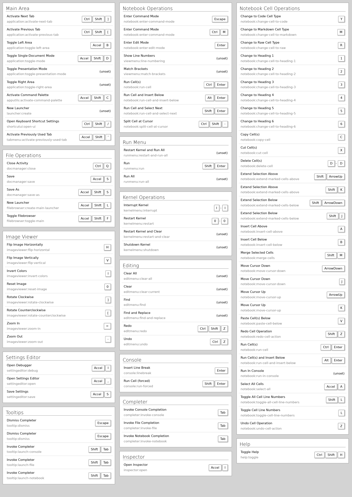

# H1
## H2
### H3

**bold text**

*italicized text*
_italic_
**_italic+bold_**
> blockquote

1. First item
2. Second item
3. Third item
	1. 11
	1. 22 

- First item
- Second item
- Third item
    - 네칸 뛰워 단변화
		- 여기도

	`code`

---

[markdown cheat-sheet](https://www.markdownguide.org/cheat-sheet/)
<!-- 주석 도 나오나?
  상대경로로 그림추가 실패
HTML 양식으로 가능한지 확인바람.
-->


| Syntax      | Description | Test Text     |
| :---        |    :----:   |          ---: |
| Header      | Title       | Here's this   |
| Paragraph   | Text        | And more      |

```json
{
"firstName": "John",
"lastName": "Smith",
"age": 25
}
```

Here's a sentence with a footnote. [^1]

[^1]: This is the footnote.

### My Great Heading {#heading-ids}

[Heading IDs](#heading-ids)

First list
: This is the definition of the first list.

Second list
: This is one definition of the second list.
: This is another definition of the second term.

~~The world is flat.~~

- [x] Write the press release
- [ ] Update the website
- [ ] Contact the media

That is so funny! :joy:
[Emojipedia](https://emojipedia.org/)
[ShortCodeEmoji](https://gist.github.com/rxaviers/7360908)

I need to highlight these ==very important words==.

H~2~O

X^2^

$-b \pm \sqrt{b^2 - 4ac} \over 2a$
$x = a_0 + \frac{1}{a_1 + \frac{1}{a_2 + \frac{1}{a_3 + a_4}}}$
$$\forall x \in X, \quad \exists y \leq \epsilon$$

|Notice Type	|Class|
|---|---|
|Default	|.notice|
|Primary	|.notice--primary|
|Info	|.notice--info|
|Warning	|.notice--warning|
|Success	|.notice--success|
|Danger	|.notice--danger|